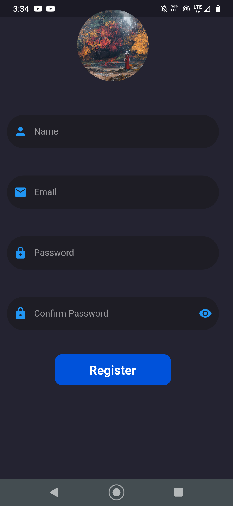

# Chatter

## A brief description of this project 
#### A fully functional chat application built on Flutter and Firebase (for backend) with image sharing capability that allows users to chat with each other(one to one or group chat). Users are registered (sign up) and authenticated(sign in) through firebase. For state management persistent and authentication provider is used.

 


## Features

- #### Signin/signup using Firebase
- #### Forget Password  
- #### Send and receive messages in real time 
- #### Stream to get chats from Firestore database
- #### Both text and images can be shared 
- #### Chats can be deleted  
- #### one to one and group chats
- #### Message sent time
- #### Shows user status(online and offline) 
- #### last active time of user
- #### Search user via username

## Additional Dependencies Required

```bash
 firebase_core: ^1.6.0
 firebase_analytics: ^8.3.1
 firebase_storage: ^10.0.3
 firebase_auth: ^3.1.0
 cloud_firestore: ^2.5.1
 provider: ^6.0.0
 file_picker: ^4.0.1
 get_it: ^7.2.0
 flutter_spinkit: ^5.1.0
 flutter_keyboard_visibility: ^5.1.0
 timeago: ^3.1.0
```

 
 Add the above lines in your pubspec.yaml file under dependencies section
 and run command
 ```bash
 flutter pub get
```
 to install these packages in your flutter project
## Deployment

To deploy this project

* Clone this repo

* Run this command 
```bash
  flutter pub get
```
* Integrate your project with [Firebase](https://console.firebase.google.com/u/0/)

* Create a AVD through Android Studio or use a physical mobile through usb debbuging 

* Run this command
 ```bash
 flutter run
 ```


## Screenshots

|       Login Screen    |  Register Screen    |
|       :--------:   | :-------: |
|  |  |

| All Chats Page   | Single chat page |
|:------:          |:---------------: |
|||

|Search User page|
|     :-------:  |
||


## Documentation

* [Flutter](https://docs.flutter.dev/)
* [Firebase](https://firebase.google.com/docs)

